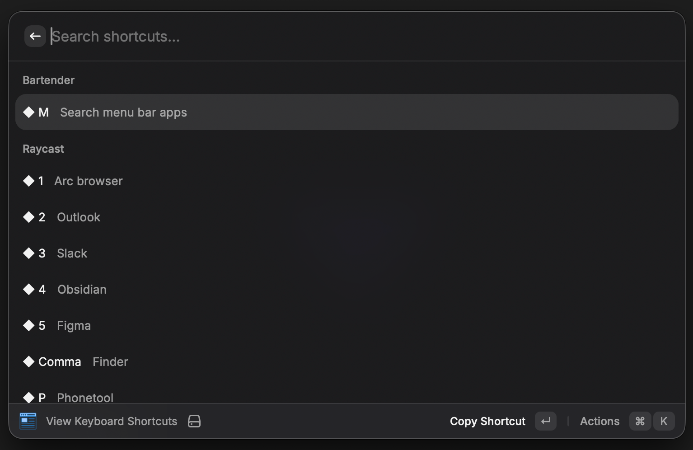

# Keyboardy

A Raycast extension that displays keyboard shortcuts and cheatsheets from a markdown file directly in Raycast's interface.



## Features

- **Search shortcuts** across all applications and categories
- **Browse organized shortcuts** by app/category sections
- **View subsections** for grouped shortcuts within apps
- **Copy to clipboard** any shortcut with one action
- **Flexible path support** with tilde (~) expansion for home directory

## Installation

1. Clone this repository
2. Install dependencies:
   ```bash
   npm install
   ```
3. Build and link to Raycast:
   ```bash
   npm run dev
   ```

## Configuration

After installing, configure the extension in Raycast preferences:

- **Cheatsheet Path**: Path to your markdown cheatsheet file (e.g., `~/Documents/shortcuts.md`)

## Markdown Format

The extension supports two markdown formats: standard markdown and Obsidian callout syntax.

### Standard Markdown (Recommended)

```markdown
## Application Name

### Navigation
| Key | Description |
| --- | --- |
| Cmd+K | Command palette |
| Cmd+P | Quick open file |

### Editing
| Key | Description |
| --- | --- |
| Cmd+Z | Undo |
| Cmd+Shift+Z | Redo |

## Another App

| Key | Description |
| --- | --- |
| Ctrl+A | Select all |
```

### Obsidian Callout Syntax

```markdown
> [!IMPORTANT] Application Name
> **Navigation**
> | Key | Description |
> | --- | --- |
> | Cmd+K | Command palette |
```

### Format Rules

| Element | Standard Markdown | Obsidian Callout |
|---------|-------------------|------------------|
| Section | `## Name` | `> [!IMPORTANT] Name` |
| Subsection | `### Name` | `> **Name**` |
| Shortcut Row | `\| Key \| Description \|` | `> \| Key \| Description \|` |

## Development

### Prerequisites

- Node.js (v20+ recommended)
- Raycast installed

### Scripts

| Command | Description |
|---------|-------------|
| `npm run dev` | Start development server |
| `npm run build` | Build for distribution |
| `npm run lint` | Check code quality |
| `npm run fix-lint` | Auto-fix linting issues |

### Project Structure

```
keyboardy/
├── src/
│   ├── index.tsx      # Main Raycast command component
│   ├── parser.ts      # Markdown file parser
│   └── types.ts       # TypeScript interfaces
├── assets/
│   └── command-icon.png
├── package.json
└── tsconfig.json
```

## How It Works

1. The extension reads the markdown file specified in preferences
2. The parser extracts sections, subsections, and shortcut tables
3. Shortcuts are displayed in a searchable Raycast list
4. Users can search, browse, and copy shortcuts to clipboard

## License

MIT
